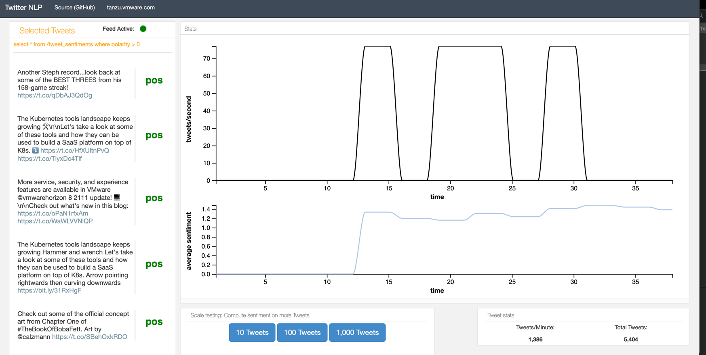

# Twitter Demo PCC Services

This web application is a Data Science based demonstration for [Twitter](https://twitter.com) [Feeds](https://developer.twitter.com/en).
It uses [Apache Geode](https://geode.apache.org/) or [Tanzu GemFire](https://tanzu.vmware.com/gemfire) to store and analyze tweets.
It calculates tweets per second using technologies such
as  [Apache Geode continuous queries](https://geode.apache.org/docs/guide/114/developing/continuous_querying/chapter_overview.html),
[Websockets](https://developer.mozilla.org/en-US/docs/Web/API/WebSockets_API) / [STOMP](http://stomp.github.io/) and [HTTP Server Side Events](https://developer.mozilla.org/en-US/docs/Web/API/Server-sent_events/Using_server-sent_events).

It also uses the [Standford CoreNLP](https://stanfordnlp.github.io/CoreNLP/) project for the polarity [sentiment analysis](https://en.wikipedia.org/wiki/Sentiment_analysis) of the tweets in realtime.


The applications based on [Spring Boot](https://spring.io/projects/spring-boot).


Application                         |   Notes
---------------------------------   |   ----------------------
[sentiment-analysis-processor](applications/sentiment-analysis-processor)        | Spring application with [Cache Listener](https://geode.apache.org/docs/guide/114/developing/events/implementing_cache_event_handlers.html) based application for tweets to calculate sentiment
[twitter-analysis-app](applications/twitter-analysis-app)      | Spring Web dashboard application is displays popularity, rates and other statistics
[twitter-api-source](applications/twitter-api-source)           | Spring application that using [Twitter streaming API](https://developer.twitter.com/en/docs/tutorials/consuming-streaming-data) to get realtime tweet
[twitter-generator-source](applications/twitter-generator-source)         | Spring application to simulate generated Tweets


## Apache Geode Setup

Start [Gfsh](https://geode.apache.org/docs/guide/114/tools_modules/gfsh/chapter_overview.html) tool

```shell
gfsh
```

Start Locator

```shell
start locator --name=locator
```

Enable PDX serialize 
```shell
configure pdx --read-serialized=true --disk-store
```

Start Server

```shell
start server --name=server
```


```shell
create region --name=tweet_text --type=PARTITION  --entry-time-to-live-expiration=10 --enable-statistics=true
```

```shell
create region --name=tweets --type=PARTITION  --entry-time-to-live-expiration=10 --enable-statistics=true
```
```shell
create region --name=tweet_rates --type=REPLICATE
````

```shell
create region --name=tweet_sentiments --type=PARTITION --entry-time-to-live-expiration=10 --enable-statistics=true
```


## Cleanup

In Gfsh

```shell
destroy region --name=/tweet_text
destroy region --name=/tweet_sentiments
destroy region --name=/tweet_rates
destroy region --name=/tweets
```

## Building Application

```shell
mvn package 
```

## Starting Applications

### Start sentiment-analysis-processor

```shell
java -jar applications/sentiment-analysis-processor/target/sentiment-analysis-processor-0.0.1-SNAPSHOT.jar --server.port=-1
```

### Start sentiment-analysis-processor

Create YAML in location

applications/twitter-analysis-app/src/main/resources/application.yml


You will need to [Twitter Authentication Token](https://developer.twitter.com/en/docs/authentication/oauth-2-0/bearer-tokens)

```yaml
export BEARER_TOKEN="YOURTOKENHERE"
```

Start Application
```shell
java -jar applications/twitter-api-source/target/twitter-api-source-0.0.1-SNAPSHOT.jar --tweet.api.token=$BEARER_TOKEN --server.port=5061
```
## Start twitter-api-source


Start application

```shell
java -jar applications/twitter-analysis-app/target/twitter-analysis-app-0.0.1-SNAPSHOT.jar --server.port=5050 --tweet.stomp.destination=/topic/tweets --tweet.sentiment.continuous.query="select * from /tweet_sentiments where polarity > 0"
```


Open Dashboard

```shell
open http://localhost:5050
```

